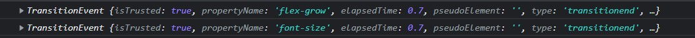

1. 关于box-sizing样式  
box-sizing有两种值，content-box(默认)和border-box  
我们学过的盒子模型，就是讲的content-box，也就是说在css设置的width或height指的是内容的width或height  
而border-box，是告诉浏览器：你想要设置的border和padding的值是包含在 width 内的。也就是说，如果你将一个元素的 width 设为 100px，那么这 100px 会包含它的 border 和 padding，内容区的实际宽度是 width 减 去(border + padding) 的值。大多数情况下，这使得我们更容易地设定一个元素的宽高。  

2. 关于flex布局
首先经过这个练习，可以马上知道，使用flex布局来垂直居中子元素，做法是：   
```
/* 给父元素设置flex布局 */
display:flex;
justify-content: center;
align-items: center;
```
其实我之前了解过一点flex弹性布局，但也仅限于用过，这次打算再了解下加深印象。  
首先，flex布局下的子元素都会根据布局的设置进行自适应，所以也叫弹性布局(flexiable box)  
给容器设置display:flex即设置该容器为弹性布局。  
在弹性布局中，默认有两条参考线，一条为主轴，是从容器最左端(main start)延申到最右端(main end)的一条水平轴线，也可以理解为x轴；另一条为交叉轴，是从容器最上端(cross start)延申到最下端(cross end)的一条竖直轴线，也可以理解为y轴。  
在容器里的每个子元素都叫item，他们都会占有一定的主轴空间(main size)和交叉轴空间(cross size)  
详情请看[这里](https://www.jianshu.com/p/19c35a1ef31e)。有了以上概念后，就可以理解后面各个参数的意义了。  
**flex-direction属性**  
这个属性决定了主轴的方向。注意，如果你不设置这个属性，默认主轴为从容器最左端到最右端的水平方向，也就是之前概念里所说的主轴，那么如果设置改变主轴方向为竖直后，原来的交叉轴会自动变为水平轴吗？这个问题稍后再解答。    
该属性值有：  
- row：默认排列方向，即主轴为水平方向，起点为左侧
- row-reverse：主轴为水平方向，起点为右侧
- column：主轴为竖直方向，起点为上沿
- column-reverse：主轴为竖直方向，起点为下沿  
基本上记住row和column就好。  
**flex-wrap属性**  
决定了当一行放不下所有的项目时，其换行与否以及换行方式  
- nowrap：默认值，即不换行
- wrap：换行，第一行在上面
- wrap-reverse：换行，第一行在下面  
**justify-content属性**  
定义了项目在主轴上的对齐方式，假设主轴是从左向右的水平排列  
- flex-start：默认值，左对齐。即沿着主轴向最左端靠拢对齐，下同理。
- flex-end：右对齐
- center：居中  
**align-items属性**  
定义了项目在交叉轴上的对齐方式，假设交叉轴是从上到下排列  
- flex-start：交叉轴起点对齐。即沿着交叉轴向最上端靠拢对齐，下同理。
- flex-end：交叉轴终点对齐
- center：交叉轴中点对齐
- baseline：项目的第一行文字的基准线对齐  
所以在练习代码中，设置justify-content:center;和align-items:center;是为了将子元素水平垂直居中。  
好，现在再来看之前的问题，如果设置改变主轴方向为竖直后，原来的交叉轴会自动变为水平轴吗？  
我特意写了个测试案例，经过验证，原来的交叉轴会自动变为水平轴。  
还有最后一个知识点，实质上flex:1是缩写，如果不深入了解，可以简单理解为flex就是设置子元素在剩余容器空间中所占的空间比例，如果各个子元素flex值均为1，则这些子元素均分容器当前剩余的空间大小。下次等用到了我再详细了解下flex各个详细参数。

3. 关于动画结束事件  
在之前的挑战练习中，也有写过动画结束事件，但没注意到的是，如果多个动画几乎同时结束，就会异步触发动画结束事件多次。这个细节容易被忽略，下面我具体讲讲这个细节。  
首先在练习中，可以看到每个panel都给动画结束事件绑定了回调函数toggleActive，我们在回调函数里打印一下传进来的事件参数e，可以看到  
  
可以看到，是有两个动画结束的，这意味着会调用回调函数两次，所以如果你是像视频中那样toggle的话，连续调两次相当于没调；如果你把toggle换成add的话，依然能看到效果。  
所以为什么作者需要判定到是flex-grow或者flex才toggle，这些细节还是要注意下的，细心总不会错的。